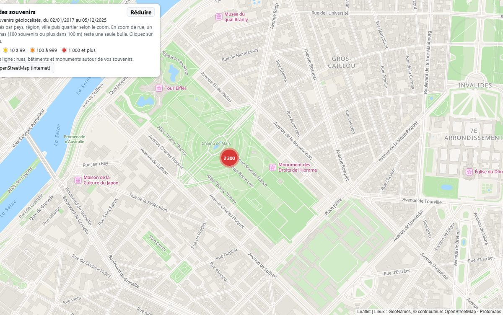
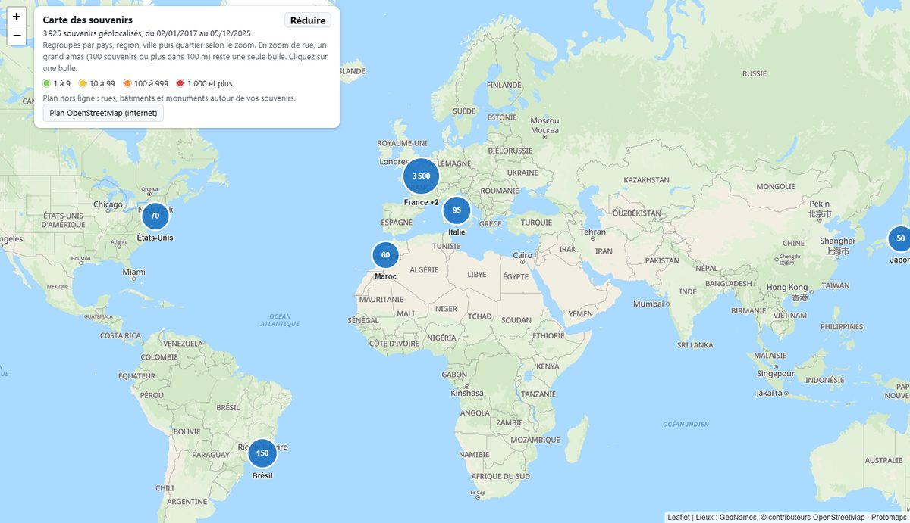
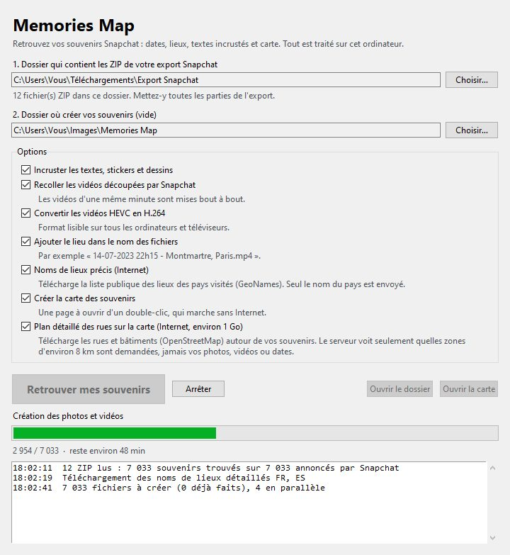

# Memories Map

*[English version below](#english)*

**Vos souvenirs Snapchat, enfin rangés et sur une carte.**

Téléchargés depuis Snapchat, vos souvenirs perdent leur date et leur lieu. Memories Map, logiciel gratuit pour
Windows, les leur rend : chaque photo et vidéo retrouve sa date d'origine, sa position GPS, ses textes et ses
stickers. Une carte interactive vous permet ensuite de retrouver chaque souvenir là où vous l'avez pris.

### [Télécharger Memories Map pour Windows](https://github.com/Memories-Map/memories-map/releases/latest/download/Memories-Map.zip)

Gratuit · Windows 10 et 11 (64 bits) · aucun compte à créer · vos photos et vidéos ne quittent jamais votre ordinateur



## Ce que fait Memories Map

| Téléchargés depuis Snapchat | Avec Memories Map |
|---|---|
| Date : celle du téléchargement, pas celle du souvenir | Date et heure d'origine, à l'heure locale du lieu |
| Lieu : aucun | Position GPS écrite dans chaque fichier : « Lieux » sur iPhone, carte de Google Photos |
| Textes et stickers dans des fichiers à part | Textes, stickers et dessins incrustés |
| Longues vidéos découpées en morceaux | Vidéos recollées, au format H.264 lisible partout |

- Fichiers nommés par date et lieu, par exemple `14-07-2023 22h15 - Montmartre, Paris.jpg`, rangés par année et
  par mois.
- Une carte de vos souvenirs, du monde entier jusqu'au nom des rues, regroupés par pays, ville et quartier. Elle
  s'ouvre d'un double-clic et marche sans Internet.
- Exports de toutes tailles, de quelques souvenirs à plusieurs centaines de Go. Le traitement peut être arrêté puis
  repris là où il s'est arrêté.



## Comment ça marche

1. **Demandez vos souvenirs à Snapchat.** Dans l'appli : votre profil (votre Bitmoji), la roue dentée en haut à
   droite, « Mes données », « Exporter mes souvenirs », période « Depuis toujours », puis votre adresse e-mail.
2. **Téléchargez toutes les parties.** Snapchat envoie un lien par e-mail, après quelques heures à quelques jours.
   Téléchargez tous les fichiers ZIP dans un même dossier, sans les décompresser.
3. **Lancez Memories Map.** Décompressez `Memories-Map.zip` (clic droit, « Extraire tout »), ouvrez
   `Memories Map.exe`, choisissez le dossier des ZIP et un dossier vide pour le résultat, puis cliquez sur
   « Retrouver mes souvenirs ».

Prévoyez sur le disque de destination environ la taille des ZIP, plus environ 1 Go pour le plan détaillé des rues.
Memories Map vérifie la place libre avant de commencer et ne modifie jamais les ZIP d'origine.



## Si Windows affiche un avertissement

Au premier lancement, Windows peut afficher « Windows a protégé votre ordinateur », simplement parce que le
logiciel est récent et encore peu téléchargé. Cliquez sur **Informations complémentaires**, puis
**Exécuter quand même**.

Pour vérifier que votre fichier est bien l'original, comparez son empreinte SHA-256 avec celle indiquée sur la page
de la [dernière version](https://github.com/Memories-Map/memories-map/releases/latest). Ouvrez PowerShell dans le
dossier du téléchargement et tapez :

```powershell
Get-FileHash .\Memories-Map.zip -Algorithm SHA256
```

## Vos données

Tout est traité sur votre ordinateur : vos photos, vidéos et dates ne sont jamais envoyées. Deux options
facultatives utilisent Internet :

- **Noms de lieux précis** : télécharge la liste publique des lieux des pays visités (GeoNames). Seul le nom du
  pays est envoyé.
- **Plan détaillé des rues** : télécharge les rues et bâtiments (OpenStreetMap, préparés par Protomaps) autour de
  vos souvenirs. Le serveur voit seulement quelles zones d'environ 8 km sont demandées, jamais vos photos, vidéos
  ou dates.

Rien n'est installé dans Windows : pour supprimer le logiciel, effacez simplement son dossier.

## Aide

Écrivez à memoriesmap@proton.me.

## Licences

Memories Map s'appuie sur des logiciels et données libres : FFmpeg (GNU GPL), ExifTool, Leaflet, MapLibre,
Protomaps, OpenStreetMap (ODbL), GeoNames (CC BY 4.0) et Natural Earth. Le détail est dans
[LICENCES.txt](LICENCES.txt).

Snapchat est une marque de Snap Inc. Memories Map n'est ni affilié, ni soutenu, ni approuvé par Snap Inc.

---

## English

**Your Snapchat Memories, back in order and on a map.**

When you download your Memories from Snapchat, they lose their date and location. Memories Map is a free Windows
app that gives them back: each photo and video gets its original date, its GPS position, and its captions and
stickers. An interactive map then lets you find each memory where you took it.

### [Download Memories Map for Windows](https://github.com/Memories-Map/memories-map/releases/latest/download/Memories-Map.zip)

Free · Windows 10 and 11 (64-bit) · no account needed · your photos and videos never leave your computer.
The app is in French for now.

- **Original date and time**, in the local time of the place where you were.
- **GPS position** written into each file: your memories show up in Places on iPhone and on the Google Photos map.
- **Captions, stickers and drawings** burned into the photos and videos.
- **Long videos** that Snapchat split into pieces are joined back together, in H.264 so they play everywhere.
- Files named by date and place, for example `14-07-2023 22h15 - Montmartre, Paris.jpg`, sorted by year and month.
- An offline **map of your memories**, from the whole world down to street names.
- Exports of any size. Processing can be stopped and resumed where it left off.

### How it works

1. **Request your Memories from Snapchat.** In the app, open your profile (your Bitmoji), tap the gear icon at the
   top right, go to My Data, turn on the export of your Memories, choose the whole period, then enter your email
   address.
2. **Download all the parts.** Snapchat emails you a link after a few hours to a few days. Download all the ZIP
   files into one folder, without unzipping them.
3. **Run Memories Map.** Unzip `Memories-Map.zip` (right-click, Extract All), open `Memories Map.exe`, choose the
   folder with the ZIP files and an empty folder for the result, then click « Retrouver mes souvenirs » (Find my
   memories).

If Windows shows "Windows protected your PC", the app is simply new and not yet widely downloaded: click
**More info**, then **Run anyway**. To check that your file is the original, compare its SHA-256 fingerprint
(`Get-FileHash .\Memories-Map.zip -Algorithm SHA256` in PowerShell) with the one shown on the
[latest release](https://github.com/Memories-Map/memories-map/releases/latest).

### Your data

Everything is processed on your computer: your photos, videos and dates are never sent anywhere. Two optional
features use the Internet: precise place names (GeoNames, only the country name is sent) and the detailed street
map (OpenStreetMap via Protomaps, the server only sees which areas of about 8 km are requested). Nothing is
installed in Windows: to remove the app, just delete its folder.

Support: memoriesmap@proton.me. Third-party components and licenses: see [LICENCES.txt](LICENCES.txt).

Snapchat is a trademark of Snap Inc. Memories Map is not affiliated with, endorsed or sponsored by Snap Inc.
